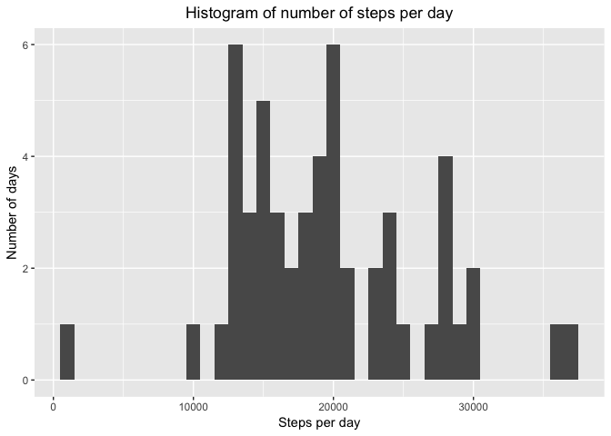
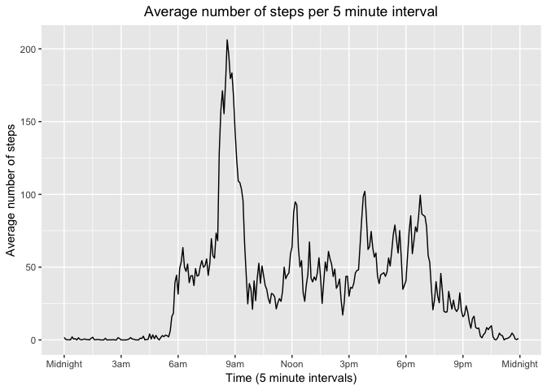
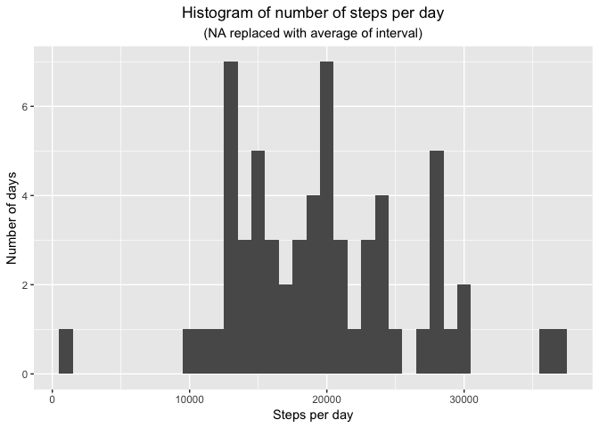
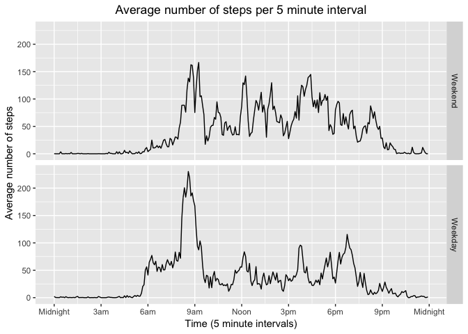

The task is to analyze some activity data.  The number of steps were recorded
for each 5 minute interval over a 2 month period.  It should be noted that on
some days, no data was recorded at all.

Before we load the data, we start by loading the libraries that will be used in
this analysis.

```r
library(dplyr)
library(ggplot2)
```

## Loading and preprocessing the data
The data is originally contained in a .zip.  If the unzipped file does not yet,
exist in the directory, we unzip the data before continuing.

```r
if(!file.exists("activity.csv")) {
    unzip("activity.zip")
}
activity <- read.csv("activity.csv")
```
In terms of processing, we modify the current form of the intervals (expressed
as "[hours][minutes]" since midnight of a given day) to be the number of minutes
since midnight.

```r
f <- function(x) {z = 0; while (x >= 100) {z = z + 60; x = x - 100}; z + x}
activity$interval <- sapply(activity$interval, f)
```


## What is mean total number of steps taken per day?
For this portion of the analysis, we ignore the missing values of the dataset.

```r
act_data <- activity %>% filter(!is.na(steps)) %>% group_by(date)
dailyTotal <- summarize(act_data, steps = sum(steps, by = date))
```
The mean number of steps each day is
19613 steps and the median number
of steps each day is 18990 steps.


```r
qplot(steps, data = dailyTotal, binwidth = 1000) + 
    labs(x = "Steps per day", y = "Number of days") + 
    labs(title = "Histogram of number of steps per day") + 
    theme(plot.title = element_text(hjust = 0.5)) # centers the title
```

<!-- -->

## What is the average daily activity pattern?
To get a sense of this person's daily activity pattern, we create a time-series 
plot showing the average number of steps for each 5-minute interval across all
days.  For this, we again ignore the missing values.


```r
act_data <- group_by(act_data, interval)
averageActivity <- summarize(act_data, steps = mean(steps, by = interval))
```

A time series plot of the average number of steps per interval:


```r
ggplot(averageActivity, aes(interval, steps)) + geom_line(group = 1) +
    scale_x_continuous(breaks = c(0,180, 360, 540, 720, 900, 1080, 1260, 1440), 
                       labels = c("Midnight", "3am", "6am", "9am", "Noon", 
                                  "3pm", "6pm", "9pm", "Midnight")) + 
    labs(x = "Time (5 minute intervals)", y = "Average number of steps", 
         title = "Average number of steps per 5 minute interval") + 
    theme(plot.title = element_text(hjust = 0.5)) # to center the title
```

<!-- -->

We are now tasked with finding which 5-minute interval contains the maximum 
number of steps on average.


```r
maxAverage <- max(averageActivity$steps)
maxInterval <- averageActivity$interval[which.max(averageActivity$steps)]
intHour <- floor(maxInterval/60)
intMin <- maxInterval - 60*intHour
 # make time output look right
if (intMin < 10) {intMin <- paste(0,intMin, sep = "")}
```

The maximum average number of steps is 206, taken
in the 5-minute interval starting at 8:35.


## Imputing missing values
In the previous steps, we ignored the missing data.  However, doing so might
introduce some bias into our calculations.


```r
numMissing <- sum(is.na(activity$steps))
```

There are 2304 intervals (out of 17568) missing step 
data. Exploration of the data shows that these missing values account for all
data on 8 days. Therefore, we will fill in this missing data using the mean for
the corresponding 5-minute interval.


```r
activityImpute <- activity
activityImpute <- activityImpute %>% 
    rowwise() %>%
    mutate(intAverage = averageActivity$steps[which(interval == 
                                                   averageActivity$interval)]) %>%
    mutate(steps = replace(steps, is.na(steps), intAverage)) %>% group_by(date)
```

```
## Warning: Grouping rowwise data frame strips rowwise nature
```

```r
totalsImpute <- summarize(activityImpute, steps = sum(steps, by = date))
```


```r
qplot(steps, data = totalsImpute, binwidth = 1000) + 
    labs(x = "Steps per day", y = "Number of days") + 
    labs(title = "Histogram of number of steps per day") +
    labs(subtitle = "(NA replaced with average of interval)") +
    theme(plot.title = element_text(hjust = 0.5), 
          plot.subtitle = element_text(hjust = 0.5)) # centers the titles
```

<!-- -->

With the missing values filled in with the average steps per interval, the mean
number of steps each day is 19694
steps and the median number of steps each day is
19160 steps.  Imputing the missing
data in this way lead to an increase of 81 steps in the average number of
steps per day and an increase of  170 steps in the median.

## Are there differences in activity patterns between weekdays and weekends?

Using our dateset with the filled-in missing values, we'll now look at weekday
activity vs weekend activity.


```r
weekdayNames <- c("Monday", "Tuesday", "Wednesday", "Thursday", "Friday")
activityImpute$date <- as.Date(activityImpute$date)
dayActivity <- activityImpute %>% 
    select(-intAverage) %>%
    mutate(dayType = factor(weekdays(date) %in% weekdayNames,
                            levels = c(FALSE, TRUE),
                            labels = c("Weekend", "Weekday")))
dayCompare <- dayActivity %>% group_by(dayType, interval) %>%
    summarize(steps = mean(steps))
```

To see the difference, we'll graph each time series for weekend vs weekdays.


```r
ggplot(dayCompare, aes(interval, steps)) + 
    geom_line(group = 1) + facet_grid(dayType ~ .) +
    scale_x_continuous(breaks = c(0,180, 360, 540, 720, 900, 1080, 1260, 1440), 
                       labels = c("Midnight", "3am", "6am", "9am", "Noon", 
                                  "3pm", "6pm", "9pm", "Midnight")) + 
    labs(x = "Time (5 minute intervals)", y = "Average number of steps", 
         title = "Average number of steps per 5 minute interval") + 
    theme(plot.title = element_text(hjust = 0.5)) # to center the title
```

<!-- -->
